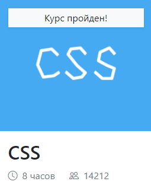
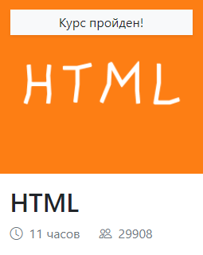
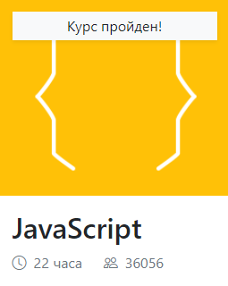

# Marcus Kordunski
### RS School Frontend Student

***

### Contact information: 

**Phone:** +48722736181 <br>
**E-mail:** marikord26@gmail.com<br>
**Telegram:** @dreamrealm<br>
**Location:** Warsaw, Poland<br>
**Discord:** Marcus Kordunski#6473<br>
[GitHub](https://github.com/MarcusKordunski)

***

### About me: 

My name is Marcus and I'm 21 years old. For now I'm student of RS School and using every source of knowledge to make my skills of frontend development better. Loving what I'm doing now and happy about getting paid for it as my future work.

***

### Skills:

* HTML5, CSS3
* JavaScript Basics
* Git, GitHub
* VS Code, PyCharm
* Python basics

***

### Code example:

**Code basics exercise:** *Write a makeItFunny() function that takes a string as input and returns a copy of it, with every nth element uppercase. n - input to the function.*
```
const makeItFunny = (str, charNumber) => {
  let i = 0;
  let realIndex = 1;
  let result = '';
  while (str.length > i) {
    if (realIndex % charNumber === 0) {
      result = `${result}${str[i].toUpperCase()}`;
    } else {
      result = `${result}${str[i]}`;
    }
  i += 1;
  realIndex+= 1;
  }
  return result;
};
```

***

### Projects:

| Project      | Skills used    |
| ------------- |:-------------:| 
| [CV](https://MarcusKordunski.github.io/rsschool-cv/cv) | Markdown & Git |               
|      *To be continued..*     |


***

### Courses:

Code-basics.com CSS, HTML and JS courses:





Python stepik.org course:


***

### Languages:

* English ~B1-B2
* Russian - native
* Polish ~A1-A2

***

